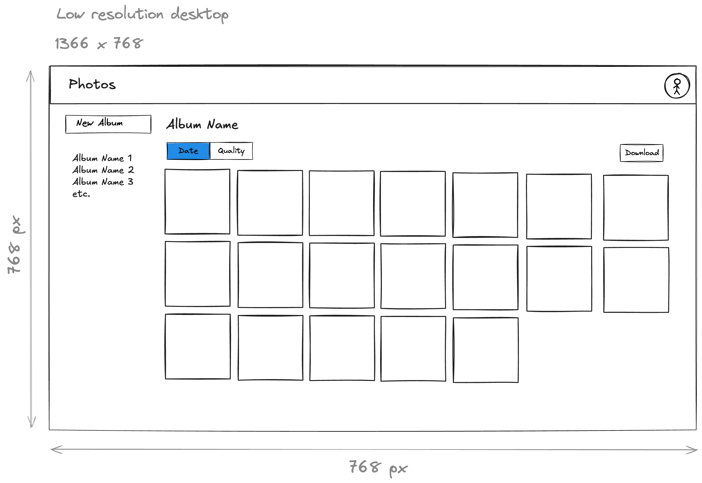

# Photos Web App

This is a web application used to demonstrate the capabilities of the Photos API.
The application should have a pretty typical web application dashboard layout:



The dashboard has three main sections:
* The top header, which contains the application title "Photos" in the top left and a placeholder for profile and account settings in the top right.
* The left navigation, which contains a button to create a new album and a list of existing albums that can be selected, in alphabetical order.  The currently selected album, if any, is highlighted.  By default, no album will be selected.
* The main content, which shows the assets in the selected album.  If no album is selected, all assets will be shown.  

Details on the main content section:
* At the top of the main content is the title, either the selected album's name, or "All Photos" if no album is selected.  
* Below the title is a row of action buttons.  
  * On the left side of a the row are filters that change what assets are displayed and how they are displayed: 
    * A toggle button that sorts and groups the album assets by capture date vs. by quality score.
    * A toggle button that stacks similar assets together.  The logic for which assets to stack together does not yet exist but will be on the backend, exposed via the API/SDK.
  * On the right side of the action row are actions like "Add photos".
    * "Add photos" brings up a dialog box to select one or more photos from the device and upload them.  If the current view is an album, add them to the album.
* The last element in the main content is a grid of asset thumbnails that flows horizontally and vertically to fill up the remaining width and the height of the page.
    * Clicking on any assets should take the user to the asset detail view.


There should be a asset detail view:
* When a particular asset is clicked, display it full-screen on a dark background.  
* There are overlaid buttons at the top right corner to show a sidebar with photo metadata and to download the asset.  For videos, display the video with appropriate playback controls.  For motion photos, automatically play the motion and include a control to pause it.

Other notes:
* For now, there's no login or authentication functionality.  Just take users directly to this dashboard page.  Load albums with the Photos SDK.  Default to showing the most recent album.  When an album is selected, highlight it in the navigation and load the associated assets.

* For now, there's no way to select groups of photos in the dashboard view, but the code should be structured to make that easy to add in the future.

# Tech Stack

This app is built with TypeScript, Next.js, React 19, Tailwind CSS 4, and shadcn.

It uses the Photos SDK (https://github.com/ternarybits/photos-sdk-typescript) and API (https://github.com/ternarybits/photos-sdk-typescript/blob/main/api.md).

## Getting Started

First, run the development server:

```bash
npm run dev
```

Open [http://localhost:3000](http://localhost:3000) with your browser to see the result.

You can start editing the page by modifying `app/page.tsx`. The page auto-updates as you edit the file.

This project uses [`next/font`](https://nextjs.org/docs/app/building-your-application/optimizing/fonts) to automatically optimize and load [Geist](https://vercel.com/font), a new font family for Vercel.

## Learn More

To learn more about Next.js, take a look at the following resources:

- [Next.js Documentation](https://nextjs.org/docs) - learn about Next.js features and API.
- [Learn Next.js](https://nextjs.org/learn) - an interactive Next.js tutorial.

You can check out [the Next.js GitHub repository](https://github.com/vercel/next.js) - your feedback and contributions are welcome!

